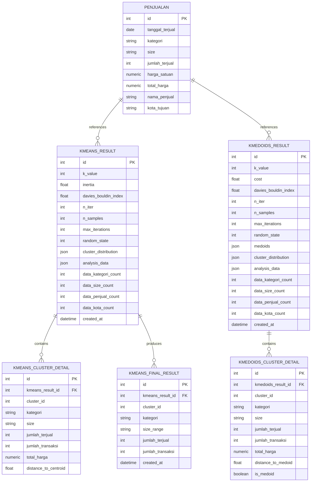

```mermaid
erDiagram
    PENJUALAN ||--o{ KMEANS_RESULT : references
    PENJUALAN ||--o{ KMEDOIDS_RESULT : references
    
    KMEANS_RESULT ||--o{ KMEANS_CLUSTER_DETAIL : contains
    KMEANS_RESULT ||--o{ KMEANS_FINAL_RESULT : produces
    KMEDOIDS_RESULT ||--o{ KMEDOIDS_CLUSTER_DETAIL : contains

    PENJUALAN {
        int id PK
        date tanggal_terjual
        string kategori
        string size
        int jumlah_terjual
        numeric harga_satuan
        numeric total_harga
        string nama_penjual
        string kota_tujuan
    }

    KMEANS_RESULT {
        int id PK
        int k_value
        float inertia
        float davies_bouldin_index
        int n_iter
        int n_samples
        int max_iterations
        int random_state
        json cluster_distribution
        json analysis_data
        int data_kategori_count
        int data_size_count
        int data_penjual_count
        int data_kota_count
        datetime created_at
    }

    KMEDOIDS_RESULT {
        int id PK
        int k_value
        float cost
        float davies_bouldin_index
        int n_iter
        int n_samples
        int max_iterations
        int random_state
        json medoids
        json cluster_distribution
        json analysis_data
        int data_kategori_count
        int data_size_count
        int data_penjual_count
        int data_kota_count
        datetime created_at
    }

    KMEANS_CLUSTER_DETAIL {
        int id PK
        int kmeans_result_id FK
        int cluster_id
        string kategori
        string size
        int jumlah_terjual
        int jumlah_transaksi
        numeric total_harga
        float distance_to_centroid
    }

    KMEDOIDS_CLUSTER_DETAIL {
        int id PK
        int kmedoids_result_id FK
        int cluster_id
        string kategori
        string size
        int jumlah_terjual
        int jumlah_transaksi
        numeric total_harga
        float distance_to_medoid
        boolean is_medoid
    }

    KMEANS_FINAL_RESULT {
        int id PK
        int kmeans_result_id FK
        int cluster_id
        string kategori
        string size_range
        int jumlah_terjual
        int jumlah_transaksi
        datetime created_at
    }
```
